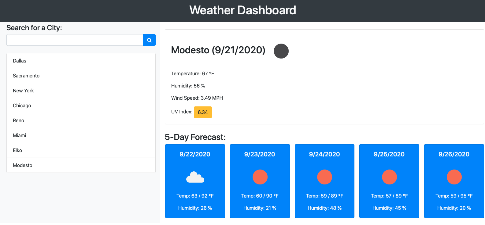

# weather_dashboard

## Description

This is a weather dashboard that will run in the browser and feature dynamically updated HTML and CSS. It uses the [OpenWeather API](https://openweathermap.org/api) to retrieve weather data for cities and uses `localStorage` to store any previously searched cities. It also uses [ipapi](https://ipapi.co/) to retrieve the users city through their IP address.

-------------

## Deployed App

Link to deployed app: [Weather Dashboard](https://crowandrew.github.io/weather_dashboard/)

-------------

## Visuals
 
 Screenshot of initial screen



-------------

## Deep dive into the JS Code used.

### Below I will break down the code for the `script.js` that handles most of the logic:

(Click on the triangle to see the code and a more detailed description of what is happening.)

<details>
<summary>Grab data for local storage and render page</summary>
<p></p>

```javascript
let citySearches = checkCitySearches();
currentLocation();
renderSearchedCities();
```
</details>

<details>
<summary>Check to see if city searches local storage is blank if it is create blank array</summary>
<p></p>

```javascript
function checkCitySearches() {
    let localArr = JSON.parse(localStorage.getItem("CitySearches"));
    if (localArr === null) { localArr = []; }
    return localArr
}
```
</details>

<details>
<summary>Grabs users IP and gives city</summary>
<p></p>

```javascript
function currentLocation() {
    $.get("https://ipapi.co/json/", function (response) { findLatLon(response.city) });
}
```
</details>

<details>
<summary>Render Searched Cities</summary>
<p></p>

```javascript
function renderSearchedCities() {
    $("#search-list").html("")
    if (citySearches === null) { return }
    citySearches.forEach(citySearch => {
        let newCityRow = $("<li>").addClass("list-group-item").attr("id", citySearch.city).text(citySearch.city)
        $("#search-list").append(newCityRow);
    });
}
```
</details>

<details>
<summary>Grabs latitude and longitude and responds with current weather and 7 day forecast</summary>
<p></p>

```javascript
function currentWeather(cityName, lat, lon) {
    $.get(`https://api.openweathermap.org/data/2.5/onecall?lat=${lat}&lon=${lon}&appid=692496d9b9647012326807b41694aa6b&units=imperial`, function (response) {
        let currentDate = convertDate(response.current.dt),
            currentTemp = response.current.temp,
            currentHumidity = response.current.humidity,
            currentWind = response.current.wind_speed,
            currentUV = response.current.uvi,
            currentIcon = response.current.weather[0].icon,
            currentIconDescription = response.current.weather[0].description;
        renderCurrentWeather(cityName, currentDate, currentTemp, currentHumidity, currentWind, currentUV, currentIcon, currentIconDescription);
        renderFiveDayForecast(response);
    })
}
```
</details>

<details>
<summary>Render current weather</summary>
<p></p>

```javascript
function renderCurrentWeather(cityName, currentDate, currentTemp, currentHumidity, currentWind, currentUV, currentIcon, currentIconDescription) {
    $("#current-row").html("")
    let divCard = $("<div>").addClass("card-body"),
        H2 = $("<h2>").addClass("card-title").text(`${cityName} (${currentDate})`),
        Icon = $("").attr("src", `https://openweathermap.org/img/wn/${currentIcon}@2x.png`).attr("alt", currentIconDescription),
        Temp = $("<p>").addClass("card-text").text(`Temperature: ${currentTemp.toFixed(0)} \u2109`),
        Humidity = $("<p>").addClass("card-text").text(`Humidity: ${currentHumidity} %`),
        Wind = $("<p>").addClass("card-text").text(`Wind Speed: ${currentWind} MPH`),
        UV = $("<p>").addClass("card-text").html(`UV Index: <button class='btn' id='uv-btn'>${currentUV}</button`);
    H2.append(Icon);
    divCard.append(H2, Temp, Humidity, Wind, UV);
    $("#current-row").append(divCard);
    checkUVIndex(currentUV);
}
```
</details>


<details>
<summary>Render 5 Day Forecast</summary>
<p></p>

```javascript
function renderFiveDayForecast(response) {
    $("#daily-row").html("")
    for (let i = 1; i < 6; i++) {
        const daily = response.daily[i];
        let dailyDate = convertDate(daily.dt),
            dailyIcon = daily.weather[0].icon,
            dailyIconDescription = daily.weather[0].description,
            dailyTempMin = daily.temp.min.toFixed(0),
            dailyTempMax = daily.temp.max.toFixed(0),
            dailyHumidity = daily.humidity,
            divCard = $("<div>").addClass("card col-sm ml-3 mb-3 bg-primary text-light card-width"),
            divCardBody = $("<div>").addClass("card-body text-center"),
            dailyH5 = $("<h5>").addClass("card-title h5").text(dailyDate),
            dailyImg = $("").attr("src", `https://openweathermap.org/img/wn/${dailyIcon}@2x.png`).attr("alt", dailyIconDescription),
            dailyPTemp = $("<p>").addClass("card-text").text(`Temp: ${dailyTempMin} / ${dailyTempMax} \u2109`),
            dailyPHumidity = $("</p>").addClass("card-text").text(`Humidity: ${dailyHumidity} %`);
        divCardBody.append(dailyH5, dailyImg, dailyPTemp, dailyPHumidity);
        divCard.append(divCardBody);
        $("#daily-row").append(divCard);
    }
}
```
</details>

<details>
<summary>Highlight UV Index</summary>
<p></p>

```javascript
function checkUVIndex(currentUV) {
    if (currentUV <= 2) {
        $("#uv-btn").addClass("btn-success");
    } else if (currentUV <= 7) {
        $("#uv-btn").addClass("btn-warning");
    } else {
        $("#uv-btn").addClass("btn-danger");
    }
}
```
</details>

<details>
<summary>Converts city name into latitude and longitude and inputs that into currentWeather</summary>
<p></p>

```javascript
function findLatLon(city) {
    $.get(`https://api.openweathermap.org/data/2.5/weather?q=${city}&appid=05b151abf8878f4a65f1f748137f62da`, function (response) {
        currentWeather(response.name, response.coord.lat, response.coord.lon);
        addNewSearchedCity(response.name, response.coord.lat, response.coord.lon);
        renderSearchedCities();
    });
}
```
</details>

<details>
<summary>Add City to citySearches Array</summary>
<p></p>

```javascript
function addNewSearchedCity(cityName, lat, lon) {
    let newCity = { city: cityName, latitude: lat, longitude: lon }
    if (citySearches === null) {
        citySearches.unshift(newCity);
        localStorage.setItem("CitySearches", JSON.stringify(citySearches))
    } else if (citySearches.some(function (el) { return el.city === cityName })) {
        return
    }
    else if (citySearches.length === 11) {
        citySearches.pop();
    }
    citySearches.unshift(newCity);
    localStorage.setItem("CitySearches", JSON.stringify(citySearches))
}
```
</details>

<details>
<summary>Converts Unix TimeStamp to MM/DD/YYYY</summary>
<p></p>

```javascript
function convertDate(unixTimeStamp) {
    let date = new Date(unixTimeStamp * 1000);
    return (`${(date.getMonth() + 1)}/${date.getDate()}/${date.getFullYear()}`)
}
```
</details>

<details>
<summary>Event listener for search</summary>
<p></p>

```javascript
$("#search-form").on("submit", function (event) {
    event.preventDefault();
    findLatLon($("#search-input").val().trim());
    $("#search-input").val() = "";
});
```
</details>

<details>
<summary>Event Listener for Search buttons</summary>
<p></p>

```javascript
$("#search-list").on("click", function (event) {
    event.preventDefault();
    findLatLon(event.target.id);
})
```
</details>

-------------

## Author

Andrew Crow

-------------

## License

MIT License

Copyright (c) 2020 Andrew Crow

Permission is hereby granted, free of charge, to any person obtaining a copy
of this software and associated documentation files (the "Software"), to deal
in the Software without restriction, including without limitation the rights
to use, copy, modify, merge, publish, distribute, sublicense, and/or sell
copies of the Software, and to permit persons to whom the Software is
furnished to do so, subject to the following conditions:

The above copyright notice and this permission notice shall be included in all
copies or substantial portions of the Software.

THE SOFTWARE IS PROVIDED "AS IS", WITHOUT WARRANTY OF ANY KIND, EXPRESS OR
IMPLIED, INCLUDING BUT NOT LIMITED TO THE WARRANTIES OF MERCHANTABILITY,
FITNESS FOR A PARTICULAR PURPOSE AND NONINFRINGEMENT. IN NO EVENT SHALL THE
AUTHORS OR COPYRIGHT HOLDERS BE LIABLE FOR ANY CLAIM, DAMAGES OR OTHER
LIABILITY, WHETHER IN AN ACTION OF CONTRACT, TORT OR OTHERWISE, ARISING FROM,
OUT OF OR IN CONNECTION WITH THE SOFTWARE OR THE USE OR OTHER DEALINGS IN THE
SOFTWARE.